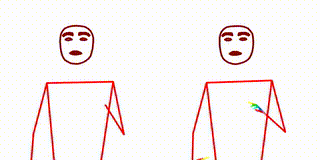
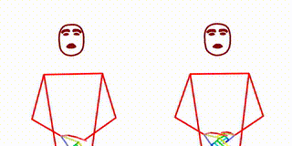
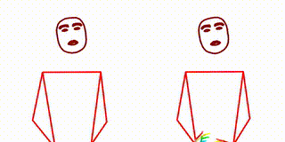
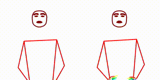

# Sign MediaPipe VQ

We try to compress mediapipe poses using VQ-VAE and then generate videos from the compressed poses.
Given a good quantizer, we can use it for downstream tasks like SignWriting transcription or animation.

## Training a model

```bash
# 0. Setup the environment.
conda create --name vq python=3.11
conda activate vq
pip install ".[dev]"

# 1. Downloads lots of poses from the bucket. (about 508GB)
DATA_DIR=/scratch/amoryo/poses
sbatch scripts/sync_bucket.sh "$DATA_DIR/sign-mt-poses"

POSES_DIR=/shares/volk.cl.uzh/amoryo/datasets/sign-mt-poses

# 2. Collect normalization data
sbatch scripts/extract_mean_std.sh "$POSES_DIR"

# 2. Creates a ZIP file of the poses after normalizing them. (about 45GB)
sbatch scripts/zip_dataset.sh "$POSES_DIR" "$DATA_DIR/normalized.zip"

# 3. Trains the model and reports to `wandb`.
sbatch scripts/train_model.sh "$DATA_DIR/normalized.zip"
```

### Mixed Precision Training

- `--dtype=float32` - Default 
- `--dtype=bfloat16` - [Now supported](https://github.com/lucidrains/vector-quantize-pytorch/issues/114) by `vector_quantize_pytorch`

## Training Output

In Weights & Biases, we can see the training progress.
In validation, we generate a video from the compressed poses (right) and compare it to the original video (left).
(This is the output using 4 codebooks of size 1024.)

| 0                                       | 1                                       | 2                                       | 3                                       | 4                                       |
|-----------------------------------------|-----------------------------------------|-----------------------------------------|-----------------------------------------|-----------------------------------------|
|  |  |  |  |  |

## Inference

To quantize a pose file, directory of poses, or Zip file of poses, use the `inference` command.
```bash
poses_to_codes --data="DIRECTORY" --output="output.csv"
```

To convert codes back to poses, use the `codes_to_poses` command.
```bash
codes_to_poses --output="DIRECTORY" --codes="codes_file.txt" 
# Or directly from codes, 5 frames example
codes_to_poses --output="test.pose" --codes="731 63 540 261 787 63 250 100 492 351 530 307 939 63 532 61 788 55 530 60"
```

## Background

Vector Quantization has been successfully used by many for highly compressing images and audio.
For example, by Deepmind and OpenAI for high quality generation of images (VQ-VAE-2) and music (Jukebox).

We use a Finite Scalar Quantization.
This work out of Google Deepmind aims to vastly simplify the way vector quantization is done for generative modeling,
removing the need for commitment losses, EMA updating of the codebook, as well as tackle the issues with codebook
collapse or insufficient utilization. They simply round each scalar into discrete levels with straight through
gradients; the codes become uniform points in a hypercube.

## Data

Data is expected as a zip file of numpy masked arrays.
See [sign_vq/data/README.md](sign_vq/data/README.md) for more details.

## Other Resources

- [MotionGPT](https://github.com/OpenMotionLab/MotionGPT): Human Motion as a Foreign Language
- [T2M-GPT](https://github.com/Mael-zys/T2M-GPT): Generating Human Motion from Textual Descriptions with Discrete
  Representations

## Downstream Tasks

- [SignWriting Transcription](https://github.com/sign-language-processing/signwriting-transcription/tree/main/signwriting_transcription/pose_to_vq_to_signwriting)
- Pose Error Correction - Given a pose sequence with missing keypoints, we can use the VQ model to fill in the missing keypoints.
- [Fluent Pose Synthesis](https://github.com/sign-language-processing/fluent-pose-synthesis) - For pose in-betweening.
- [SignWriting Animation](https://github.com/sign-language-processing/signwriting-animation)
